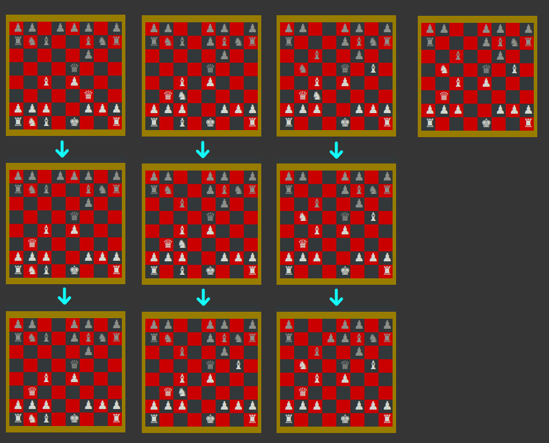

# Chess Game

## Case 1: Draw a chessboard

First chessboard is a initial board of standard position.  
Second chessboard is a board of random position.  

  

## Case 2: Move pieces from initial chessboard
* King 		`♚` (Input: K)
* Queen		`♛` (Input: Q)
* Rook		`♜` (Input: R)
* Bishop 	`♝` (Input: B)
* Knight 	`♞` (Input: N)
* Pawn   	`♟`

### Input Format
* **Movement:** Using `<piece1+position>`
	* Position should correct, and the piece movement should follow the piece's movement rule.
	* If piece2 is pawn, then do not input piece2, only position.
	* Position format: `<a-h><1-8>`
* **Capture:** Using `<piece1+position>x<piece2+position>`
	* Position should correct, and the piece movement should follow the piece's movement rule.
	* Cannot capture the same color pieces.
	* If piece2 is pawn, then do not input piece2, only position
	* e.g. If Black King capture White Pawn, then input is `K`e1xf7
	* e.g. If White Rook capture Knight, then input is Rh1xNh6 

### Movement
Input moving position, and the game would predict which pieces should move.  
First step is enter white piece movement, and then black.  
If the position is not correct (it means no piece can goto), then user should reinput again.  
 

  

 
Let's play the game!  
 
  

## Case 3: On input by case2

  

  

The last step would occur because using twice position movement intentionally.  

  